<h1 align="center">
  <br>
  
  <br>
  Makinda Themes
  <br>
</h1>

<h4 align="center">A premium light + dark theme family with warm orange accents — shipping to <strong>20+ editors, IDEs, terminals, and apps</strong> from a single source palette.</h4>

<p align="center">
  <a href="https://marketplace.visualstudio.com/items?itemName=makindajack.makinda-themes">
    
  </a>
  <a href="https://marketplace.visualstudio.com/items?itemName=makindajack.makinda-themes">
    
  </a>
  <a href="https://marketplace.visualstudio.com/items?itemName=makindajack.makinda-themes">
    
  </a>
</p>

<p align="center">
  <a href="#features">Features</a> •
  <a href="#installation">Installation</a> •
  <a href="#compatible-editors">Compatible Editors</a> •
  <a href="#activate-a-theme">Activate</a> •
  <a href="#recommended-settings">Recommended Settings</a> •
  <a href="#screenshots">Screenshots</a> •
  <a href="#contributing">Contributing</a> •
  <a href="#license">License</a>
</p>

---

## Features

This extension ships **two** complementary themes:

- **Makinda Light** — Clean white editor with subtle gray sidebars, warm orange accents, and high-contrast syntax highlighting for long, comfortable coding sessions.
- **Makinda Dark** — Deep `#0e0e0f` background with vibrant orange accents, purple types, and teal strings. 140+ token scopes and 200+ UI color definitions.

Both variants share the same brand language, so switching between them keeps your code visually consistent.

### Color Palette

| Element            | Makinda Light | Makinda Dark |
| ------------------ | ------------- | ------------ |
| Brand Orange       | `#e65800`     | `#ff711a`    |
| Functions          | `#e65800`     | `#ff9452`    |
| Keywords           | `#b34400`     | `#ff711a`    |
| Types / Classes    | `#6b26c0`     | `#a26ee2`    |
| Strings            | `#0d7377`     | `#2dd4bf`    |
| Comments           | `#71717a`     | `#7d8593`    |
| Editor Background  | `#ffffff`     | `#0e0e0f`    |
| Sidebar Background | `#fafafa`     | `#0e0e0f`    |

## Installation

### From VS Code Marketplace

1. Open the **Extensions** sidebar: `View → Extensions`
2. Search for `Makinda Themes`
3. Click **Install**

### From Command Line

```bash
code --install-extension makindajack.makinda-themes
```

### Manual Installation

1. Download the latest `.vsix` from [Releases](https://github.com/makindajack/makinda-themes/releases)
2. In VS Code, run `Extensions: Install from VSIX...` from the Command Palette and pick the file.

## Compatible Editors

Makinda is generated from a single `source/palette.json` and ports to every major editor, IDE, terminal, and chat/notes app.

### Code editors & IDEs

| Editor                     | Format                  | Install                                                   |
| -------------------------- | ----------------------- | --------------------------------------------------------- |
| **VS Code**                | `*.color-theme.json`    | `code --install-extension makindajack.makinda-themes`     |
| **Cursor**                 | (VS Code theme)         | `cursor --install-extension makindajack.makinda-themes`   |
| **Windsurf**               | (Open VSX)              | `windsurf --install-extension makindajack.makinda-themes` |
| **VSCodium / code-server** | (Open VSX)              | `codium --install-extension makindajack.makinda-themes`   |
| **JetBrains IDEs**         | `.icls` + `.theme.json` | [ports/jetbrains/](ports/jetbrains/)                      |
| **Sublime Text**           | `.sublime-color-scheme` | [ports/sublime/](ports/sublime/)                          |
| **Zed**                    | Zed theme JSON          | [ports/zed/](ports/zed/)                                  |
| **Neovim**                 | Lua + Vim fallback      | [ports/neovim/](ports/neovim/)                            |
| **Xcode**                  | `.xccolortheme` plist   | [ports/xcode/](ports/xcode/)                              |
| **Helix**                  | TOML                    | [ports/helix/](ports/helix/)                              |
| **Visual Studio**          | `.vssettings`           | [ports/visual-studio/](ports/visual-studio/)              |
| **Eclipse**                | `.epf`                  | [ports/eclipse/](ports/eclipse/)                          |
| **Emacs**                  | `deftheme` `.el`        | [ports/emacs/](ports/emacs/)                              |
| **TextMate**               | `.tmTheme` plist        | [ports/textmate/](ports/textmate/)                        |
| **BBEdit**                 | `.bbcolors` plist       | [ports/bbedit/](ports/bbedit/)                            |
| **Nova**                   | `.novaextension`        | [ports/nova/](ports/nova/)                                |
| **Lapce**                  | TOML                    | [ports/lapce/](ports/lapce/)                              |
| **Notepad++**              | XML                     | [ports/notepad-plus-plus/](ports/notepad-plus-plus/)      |

### Terminals

| Terminal             | Format         | Path                                               |
| -------------------- | -------------- | -------------------------------------------------- |
| **iTerm2**           | `.itermcolors` | [ports/iterm2/](ports/iterm2/)                     |
| **Warp**             | YAML           | [ports/warp/](ports/warp/)                         |
| **Alacritty**        | TOML           | [ports/alacritty/](ports/alacritty/)               |
| **Kitty**            | `.conf`        | [ports/kitty/](ports/kitty/)                       |
| **WezTerm**          | Lua            | [ports/wezterm/](ports/wezterm/)                   |
| **Ghostty**          | config snippet | [ports/ghostty/](ports/ghostty/)                   |
| **Windows Terminal** | JSON snippet   | [ports/windows-terminal/](ports/windows-terminal/) |

### Chat / notes

| App                         | Format         | Path                               |
| --------------------------- | -------------- | ---------------------------------- |
| **Slack**                   | sidebar string | [ports/slack/](ports/slack/)       |
| **Discord** (BetterDiscord) | CSS            | [ports/discord/](ports/discord/)   |
| **Obsidian**                | CSS theme      | [ports/obsidian/](ports/obsidian/) |

See [docs/INSTALLATION.md](docs/INSTALLATION.md) for editor-by-editor walkthroughs and [docs/IDES.md](docs/IDES.md) for the full status matrix.

## Activate a Theme

Open the Color Theme picker:

- macOS: `⌘K ⌘T`
- Windows / Linux: `Ctrl+K Ctrl+T`

Select **Makinda Light** or **Makinda Dark**.

To have VS Code switch automatically with your OS appearance, enable `window.autoDetectColorScheme` and set:

```json
{
  "window.autoDetectColorScheme": true,
  "workbench.preferredLightColorTheme": "Makinda Light",
  "workbench.preferredDarkColorTheme": "Makinda Dark"
}
```

## Recommended Settings

### Icon Themes

Pair Makinda Themes with one of these for a complete look:

- [Material Product Icons](https://marketplace.visualstudio.com/items?itemName=PKief.material-product-icons) by Philipp Kief
- [Nomo Light Icon Theme](https://marketplace.visualstudio.com/items?itemName=be5invis.vscode-icontheme-nomo-light) — pairs well with Makinda Light
- [Nomo Dark Icon Theme](https://marketplace.visualstudio.com/items?itemName=be5invis.vscode-icontheme-nomo-dark) — pairs well with Makinda Dark

> A dedicated **Makinda Icons** pack is in active development and will be released as a separate extension.

### Font Recommendations

```json
{
  "editor.fontFamily": "'Fira Code', 'JetBrains Mono', Menlo, Monaco, monospace",
  "editor.fontLigatures": true,
  "editor.fontSize": 14,
  "editor.lineHeight": 1.5
}
```

## Screenshots

### Makinda Light

<p align="center">
  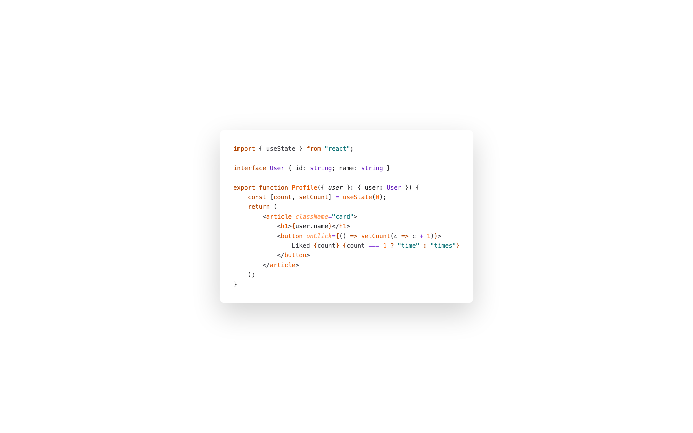
</p>
<p align="center">
  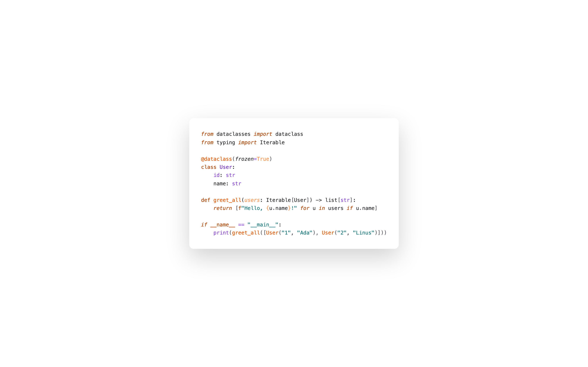
  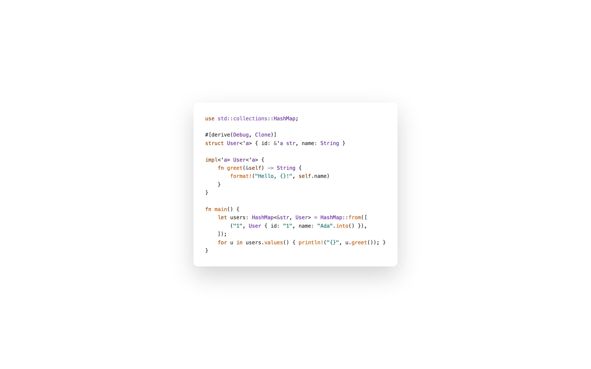
</p>
<p align="center">
  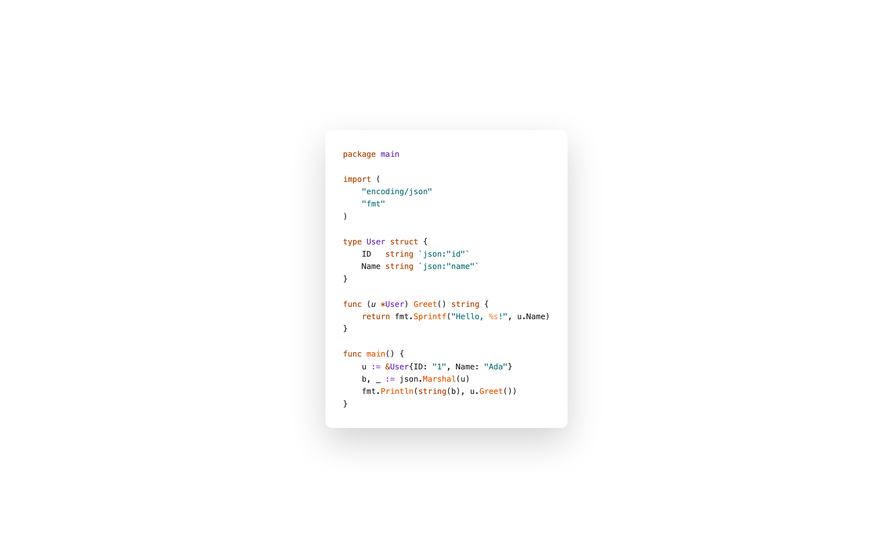
  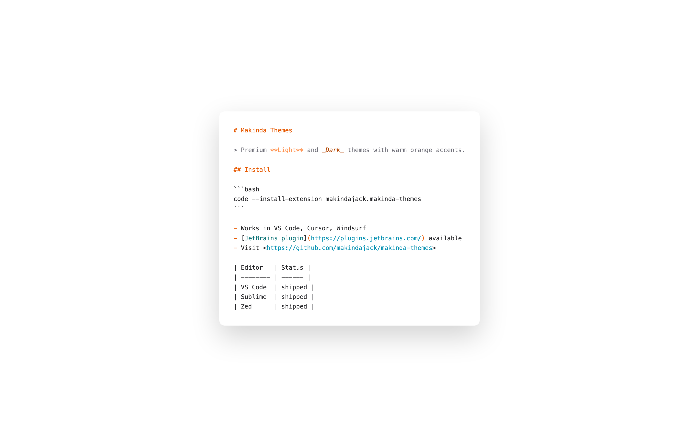
</p>
<p align="center">
  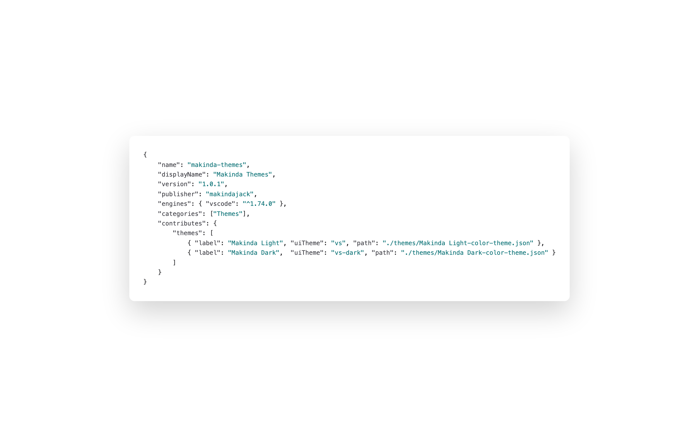
  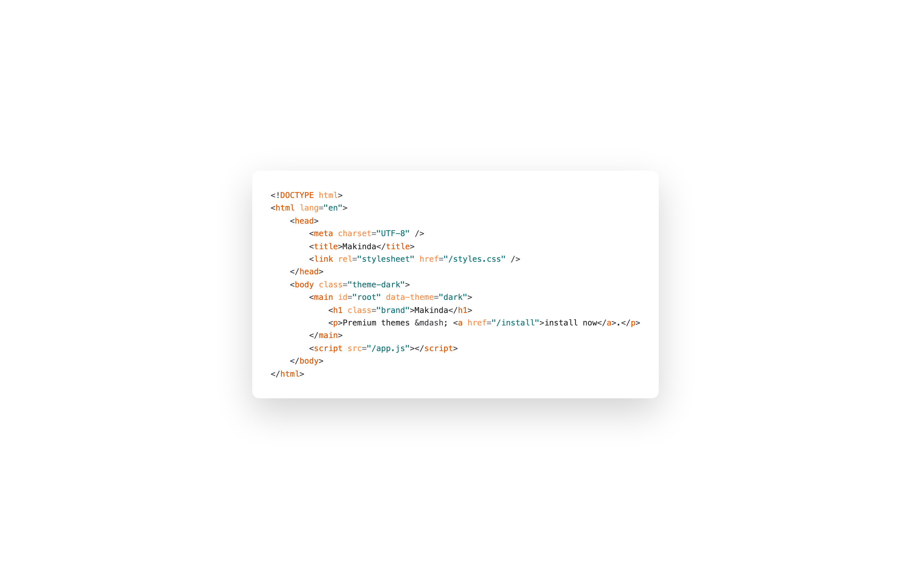
</p>

### Makinda Dark

<p align="center">
  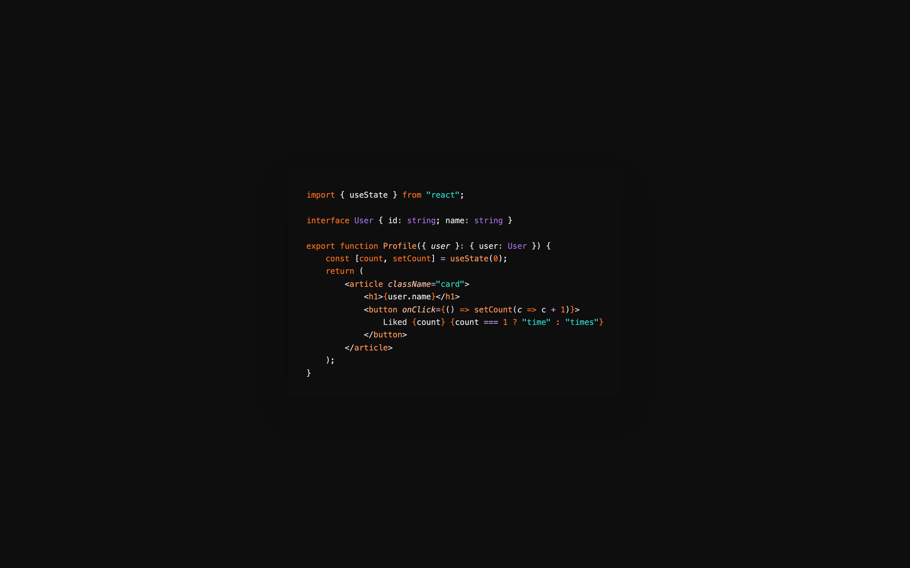
</p>
<p align="center">
  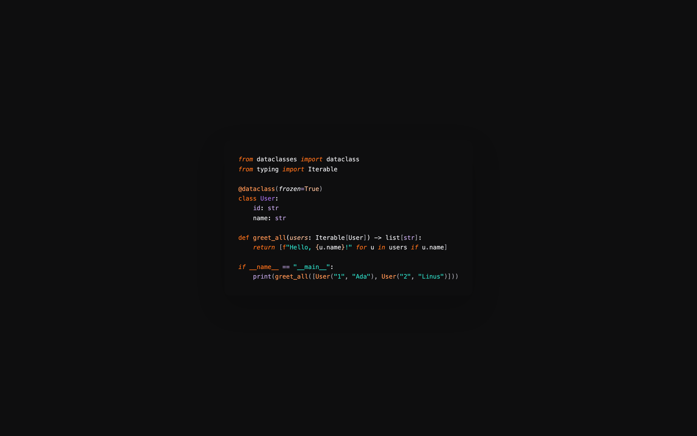
  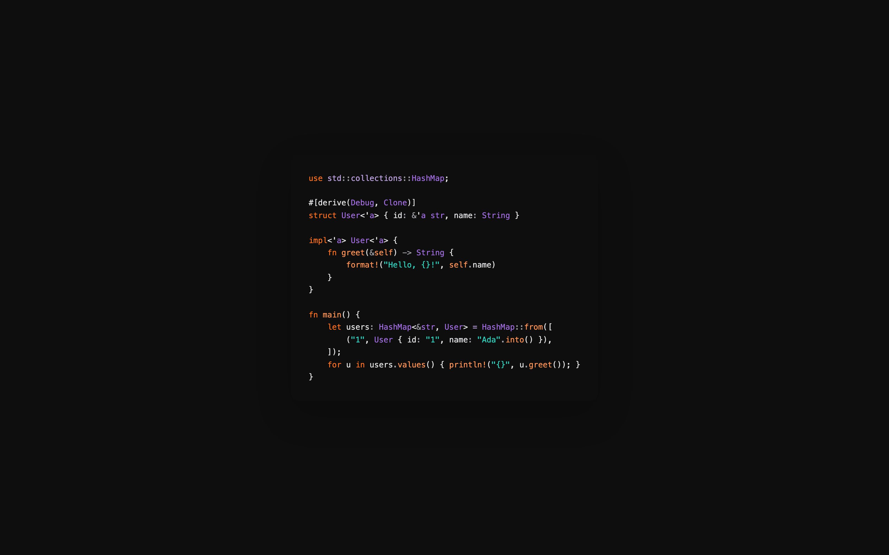
</p>
<p align="center">
  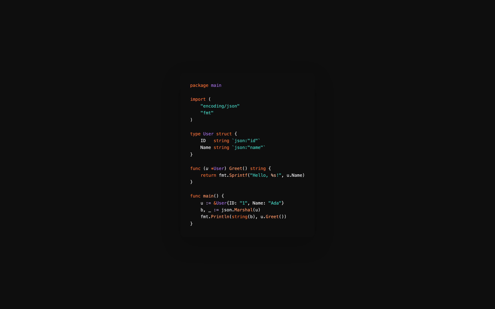
  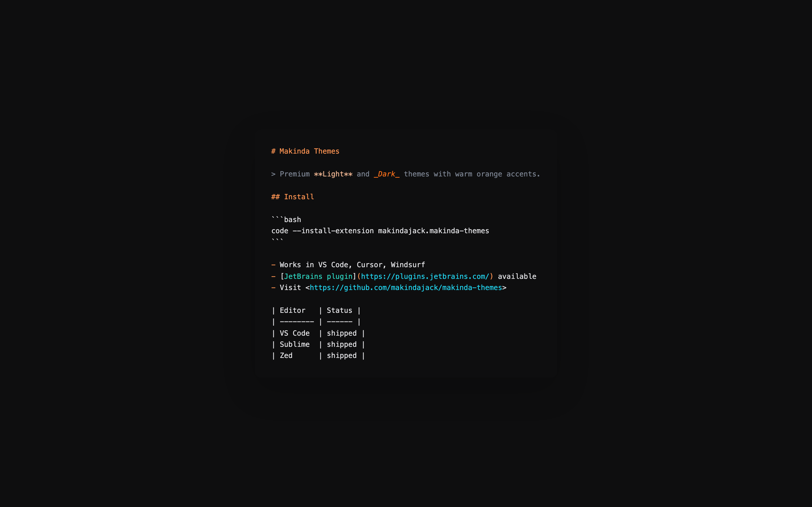
</p>
<p align="center">
  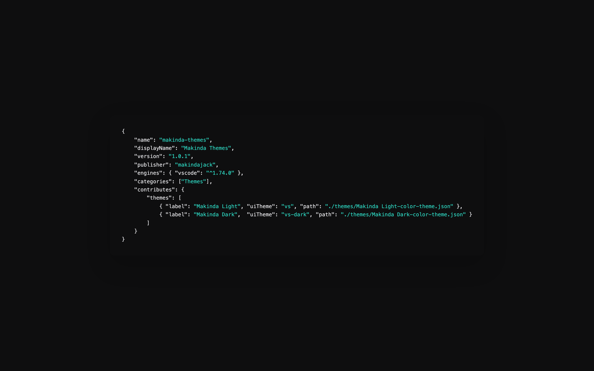
  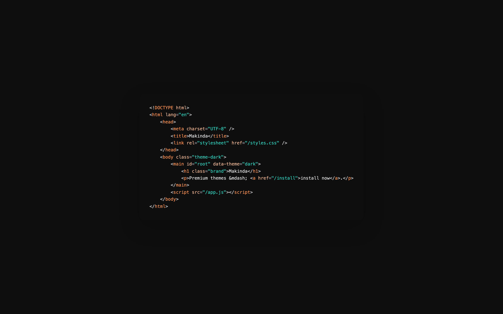
</p>

## Migrating from `makinda-dark`

The standalone `makindajack.makinda-dark` extension is deprecated as of `1.0.1`. Both themes are now bundled in `makindajack.makinda-themes`.

To migrate:

1. Install `makindajack.makinda-themes`.
2. Uninstall `makindajack.makinda-dark`.
3. Open the Color Theme picker and re-select **Makinda Dark**.

Your settings and theme preference will be preserved.

## Documentation

- [Installation Guide](docs/INSTALLATION.md)
- [Contributing](docs/CONTRIBUTING.md)
- [Publishing Guide](docs/PUBLISHING.md)
- [Development](docs/DEVELOPMENT.md)

## Contributing

Contributions are welcome. Please read the [Contributing Guide](docs/CONTRIBUTING.md) before opening issues or pull requests.

## License

[MIT](LICENSE) © [Jackson Makinda](https://github.com/makindajack)

---

<div align="center">
  Made with ❤️ by <a href="https://github.com/makindajack">Jackson Makinda</a>
</div>
